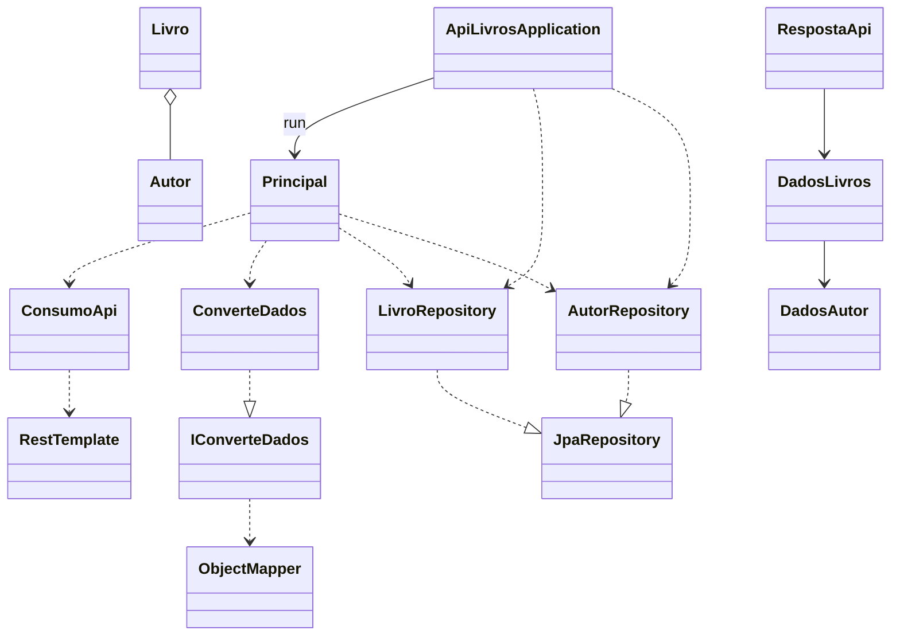

# Documentação dos Componentes Principais

## Visão Geral do Projeto  
Esta aplicação Spring Boot consome dados de livros de uma API pública, converte o JSON retornado em objetos Java e persiste informações de **livros** e **autores** em um banco de dados PostgreSQL. A interface é via **linha de comando**, organizada pela classe `Principal`. A seguir, detalhamos cada arquivo selecionado e suas integrações.



---

## ApiLivrosApplication.java  
Classe principal que inicializa o contexto Spring e dispara o menu de interação via linha de comando.  
- Anotações: `@SpringBootApplication`, implementa `CommandLineRunner`.  
- Injeta repositórios de **Livro** e **Autor**.  
- Cria instância de `Principal` e chama `exibeMenu()`.  

```java
@SpringBootApplication
public class ApiLivrosApplication implements CommandLineRunner {
    @Autowired
    private LivroRepository livroRepository;
    @Autowired
    private AutorRepository autorRepository;

    public static void main(String[] args) {
        SpringApplication.run(ApiLivrosApplication.class, args);
    }

    @Override
    public void run(String... args) {
        Principal principal = new Principal(livroRepository, autorRepository);
        principal.exibeMenu();
    }
}
```  
Responsável por orquestrar o fluxo da aplicação. 

---

## Principal.java  
Controller de menu em console, faz chamada à API, conversão e persistência de dados.  
- Dependências:
  - `ConsumoApi` para requisições HTTP.
  - `ConverteDados` para desserialização JSON.
  - `LivroRepository` e `AutorRepository` para operações de banco.
- Menu de opções oferece:
  1. Buscar e salvar livro.
  2. Listar todos livros.
  3. Listar todos autores.
  4. Autores vivos em ano específico.
  5. Livros por idioma.
- Monta URL de busca, trata JSON e persiste ou exibe resultados.  

```java
public class Principal {
    private final String ENDERECO = "https://gutendex.com/books?search=";
    private Scanner leitura = new Scanner(System.in);
    private ConsumoApi consumo = new ConsumoApi();
    private ConverteDados conversor = new ConverteDados();
    private LivroRepository livroRepository;
    private AutorRepository autorRepository;

    public Principal(LivroRepository livroRepo, AutorRepository autorRepo) {
        this.livroRepository = livroRepo;
        this.autorRepository = autorRepo;
    }

    public void exibeMenu() {
        int opcao = -1;
        while (opcao != 0) {
            System.out.println("""
                ###### MENU LIVROS ######
                1 - Buscar Livros
                2 - Listar Livros
                3 - Listar Autores
                4 - Autores Vivos em Ano
                5 - Livros por Idioma
                0 - Sair
                """);
            opcao = leitura.nextInt(); leitura.nextLine();
            switch (opcao) {
                case 1 -> buscarLivro();
                case 2 -> listarTodosLivros();
                case 3 -> listarTodosAutores();
                case 4 -> listarAutoresVivosNesteAno();
                case 5 -> listarLivrosNoIdiomaDesejado();
                case 0 -> System.exit(0);
                default -> System.out.println("Opção inválida");
            }
        }
    }
    // métodos auxiliares...
}
```  
Gerencia todo o fluxo de interação com o usuário. 

---

## ConsumoApi.java  
Componente Spring que encapsula requisições HTTP síncronas.  
- Anotação: `@Component`.  
- Usa `RestTemplate` para `GET` da URL fornecida.  

```java
@Component
public class ConsumoApi {
    public String obterDados(String endereco) {
        RestTemplate restTemplate = new RestTemplate();
        return restTemplate.getForObject(endereco, String.class);
    }
}
```  
Faz a ponte entre a aplicação e o endpoint externo. 

---

## ConverteDados.java & IConverteDados.java  
Facilitam a conversão de JSON em objetos Java usando Jackson.  
- `IConverteDados`: interface genérica.  
- `ConverteDados`: implementação, trata `JsonProcessingException` lançando `RuntimeException`.  

```java
public interface IConverteDados {
    <T> T obterDados(String json, Class<T> classe);
}

public class ConverteDados implements IConverteDados {
    private ObjectMapper mapper = new ObjectMapper();

    @Override
    public <T> T obterDados(String json, Class<T> classe) {
        try {
            return mapper.readValue(json, classe);
        } catch (JsonProcessingException e) {
            throw new RuntimeException(e);
        }
    }
}
```  
Desacopla lógica de parsing do restante da aplicação. 

---

## Modelos (package `model`)  

### DadosAutor.java  
Record que mapeia campos de autor do JSON usando `@JsonAlias`.  
```java
@JsonIgnoreProperties(ignoreUnknown = true)
public record DadosAutor(
    @JsonAlias("name") String nome,
    @JsonAlias("birth_year") Integer anoNascimento,
    @JsonAlias("death_year") Integer anoFalecimento
) {}
```  
Captura apenas atributos relevantes durante a desserialização. 

### DadosLivros.java  
Record para dados de livro do JSON, contendo lista de `DadosAutor`.  
```java
@JsonIgnoreProperties(ignoreUnknown = true)
public record DadosLivros(
    @JsonAlias("title") String titulo,
    @JsonAlias("authors") List<DadosAutor> autores,
    @JsonAlias("languages") List<String> idiomas,
    @JsonAlias("download_count") Integer numeroDownloads
) {}
```  
Estrutura intermediária antes de criar entidades JPA. 

### RespostaApi.java  
Record que encapsula o array de `DadosLivros` retornado pela API.  
```java
@JsonIgnoreProperties(ignoreUnknown = true)
public record RespostaApi(
    @JsonAlias("results") List<DadosLivros> livros
) {}
```  
Usado por `ConverteDados` para mapear resposta inteira. 

### Autor.java  
Entidade JPA representando autor.  
- Tabela: `autores`.
- Relacionamento `@ManyToOne` com `Livro`.  
```java
@Entity
@Table(name = "autores")
public class Autor {
    @Id @GeneratedValue(strategy = GenerationType.IDENTITY)
    private Long id;
    private String nome;
    private Integer anoNascimento;
    private Integer anoFalecimento;
    @ManyToOne @JoinColumn(name = "livro_id")
    private Livro livro;
    // construtor, getters, setters, toString()
}
```  
Vincula cada autor ao livro correspondente. 

### Livro.java  
Entidade JPA para livros.  
- Tabela: `livros`.
- Relacionamento `@OneToMany` com `Autor`.
- `@ElementCollection` para lista de idiomas.  
```java
@Entity
@Table(name = "livros")
public class Livro {
    @Id @GeneratedValue(strategy = GenerationType.IDENTITY)
    private Long id;
    @Column(unique = true) private String titulo;
    @OneToMany(mappedBy = "livro", cascade = CascadeType.ALL, fetch = FetchType.EAGER)
    private List<Autor> autores;
    @ElementCollection(fetch = FetchType.EAGER)
    private List<String> idiomas;
    private Integer numeroDownloads;
    // construtores, getters, setters, toString()
}
```  
Converte `DadosLivros` em entidade, criando objetos `Autor`. 

---

## Repositórios (package `repository`)  

### AutorRepository.java  
Interface JPA para `Autor`.  
- Métodos customizados:
  - `findAllByOrderByNomeAsc()`: lista autores ordenados.
  - `buscarAutoresVivosEmAno(int ano)`: via `@Query`.  

```java
public interface AutorRepository extends JpaRepository<Autor, Long> {
    List<Autor> findAllByOrderByNomeAsc();

    @Query("SELECT a FROM Autor a WHERE a.anoNascimento <= :ano AND (a.anoFalecimento IS NULL OR a.anoFalecimento >= :ano)")
    List<Autor> buscarAutoresVivosEmAno(int ano);
}
```  
Responsável por consultas avançadas de autores. 

### LivroRepository.java  
Interface JPA para `Livro`.  
- `findByTituloIgnoreCase(String titulo)`: busca livro por título.
- `findByIdiomasContaining(String idioma)`: filtra por idioma.  

```java
public interface LivroRepository extends JpaRepository<Livro, Long> {
    Optional<Livro> findByTituloIgnoreCase(String titulo);
    List<Livro> findByIdiomasContaining(String idioma);
}
```  
Suporta persistência e consultas de livros. 

---

## application.properties  
Configurações de conexão e JPA:  
```properties
spring.application.name=apiLivros
spring.datasource.url=jdbc:postgresql://${DB_HOST}/${DB_NAME}
spring.datasource.username=${DB_USER}
spring.datasource.password=${DB_PASSWORD}
spring.datasource.driver-class-name=org.postgresql.Driver
hibernate.dialect=org.hibernate.dialect.HSQLDialect
spring.jpa.hibernate.ddl-auto=update
spring.jpa.show-sql=true
spring.jpa.format-sql=true
```  
Define acesso ao banco, dialeto e comportamento de criação de esquema.

---

## ApiLivrosApplicationTests.java  
Teste de contexto do Spring Boot com JUnit 5.  
```java
@SpringBootTest
class ApiLivrosApplicationTests {
    @Test
    void contextLoads() {}
}
```  
Valida que a aplicação inicia sem erros.